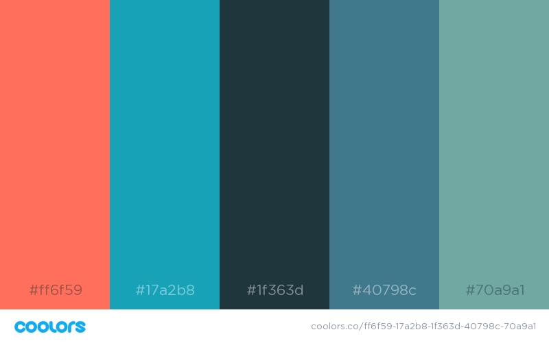

# flow
This app is based on Mihaly Csikszentmihalyi's reasearch around flow. It's a software implementation of his [Experience Sampling Form](https://link.springer.com/chapter/10.1007/978-94-017-9088-8_3), which you may use to determine what activities put you "in flow." 

When you start your flow test, you'll be prompted, randomly, to fill out a survey 6 to 9 times a day during waking hours (8 am to 10 pm) for 7 days. This will result in a total of 56 signals over the 7-day period. The survey will ask you things like "What was the MAIN thing you were doing?" and "Describe your mood as you were beeped". At the end of the test, you'll be presented with a summary of your data. 

Results computed based on page 117 of Csikszentmihalyi's [Flow and the Foundations of Positive Psychology](https://www.academia.edu/39728351/Flow_and_the_Foundations_of_Positive_Psychology_The_Collected_Works_of_Mihaly_Csikszentmihalyi). I've included [the PDF](./Flow_and_the_Foundations_of_Positive_Psy.pdf) in case you're interested.


## Color Palette 

[PDF](https://coolors.co/export/pdf/ff6f59-17a2b8-1f363d-40798c-70a9a1)

## Project setup
```
npm install
```

### Compiles and hot-reloads for development
```
npm run serve
```

### Compiles and minifies for production
```
npm run build
```

### Run your unit tests
```
npm run test:unit
```

### Run your end-to-end tests
```
npm run test:e2e
```

### Lints and fixes files
```
npm run lint
```

### Customize configuration
See [Configuration Reference](https://cli.vuejs.org/config/).
